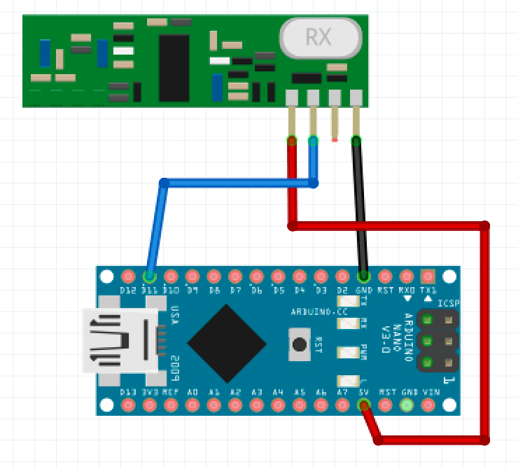

ARDUINO PLANTS MONITOR
======================

This repo contains a personal project for an Arduino based system to monitor soil humitidy in pots.
We've got around 15 potted plants in the flat and most of them are on a different watering schedule.
I grew tired to having to stick my finger in the soil to decide if it was time to water them or not
so I build up an automated system.

# Architecture
The system is made of 5 components:

- *Sender:* a small, battery powered unit installed near the plant that measures the humidity and sends
          the data over radio frequency.
- *Receiver:* an USB power arduino that acts as a bridge, listening to data coming from the radio,
            processing it and dumping it to serial.
- *Collector:* a script that listen for data on serial connection and uploads it to a DB.
- *InfluxDB:* DB instance to store the plants data.
- *Grafana:* web interface to display the DB data.

## Sender
The sender is a a small Arduino Pro Mini 8mhz 3.3v version. Clones can be found for around $1.50 a piece 
on AliExpress making it a very inexpensive solution.

**NOTE**: Make sure to buy the 3.3v 8mhz version: the 5v version is not as power efficent.

Each sender can support up to 8 soil moisture sensor (as many as the analog input on the Pro Mini). 
The sensor requires 3v + ground and outputs via an analog pin. Each time the
arduino wakes up it will read the value from each one of them and send it out over radio.

### Hardware 
Each sender is made of the following parts:
- 1x Arduino Pro Mini (or clone) 8mhz 3.3v - [AliExpress link](https://www.aliexpress.com/wholesale?catId=0&initiative_id=SB_20190117031703&SearchText=+Arduino+Pro+Mini+8mhz+3.3v)
- 1x Darlington Transistor Array (ULN2803A) - [AliExpress link](https://www.aliexpress.com/wholesale?catId=0&initiative_id=SB_20190117050927&SearchText=uln2803a)
- Prototyping wire
- 1x 433Mhz transmitter - [AliExpress link](https://www.aliexpress.com/wholesale?catId=0&initiative_id=SB_20190117051124&SearchText=rf+transmitter)
- 1x Capacitive soil moisture sensor - [AliExpress link](https://www.aliexpress.com/wholesale?catId=0&initiative_id=SB_20190117051201&SearchText=capacitive+soil+moisture+sensor)
- 2x AA batteries or 1x CR2 battery
- 1x Battery holder - like [this one](https://www.amazon.co.uk/Battery-Storage-Organizer-Container-Included-Black/dp/B07JQGST3P/ref=sr_1_2_sspa?ie=UTF8&qid=1547730893&sr=8-2-spons&keywords=battery+holder&psc=1_)
  for AA or [this one](https://www.amazon.co.uk/Battery-Holder-CR2-PCB-mount/dp/B000PEP95C/ref=sr_1_2?ie=UTF8&qid=1547730923&sr=8-2&keywords=battery+holder+cr2) for CR2

### Wiring
In order to save energy and avoid possible degradation of the soil sensor, the sender employs a transistor (in the array form as a ULN3803A) as a switch
to turn on and off the power to the sensor. So input pins of the ULN3803A are directly connected to the digital pins of the
Arduino. When the digital pin is high, the ULN3803A connects the correspondant output pin to ground, effectively powering up the sensor.

Each sensor is connected as follow:

- VCC pin directly to VCC
- Ground pin connected to the out pin of the ULN3803A
- Data pin connected to the analog pin of the Arduino

Here's a sample wiring diagram for an Arduino that supports two sensors:


### Custom PCB
The file `sender_monitor_schema.fzz` contains the design of a PCB that will make the wiring easier. To open the file you'll need a software called [Fritzing](http://fritzing.org/home/).
In order to print the PCB I found the service at [https://aisler.net](https://aisler.net) one of the best in terms of speed/price in Europe (2 weeks and ~4EUR per board).

The PCB is very simple and after you solder the arduino on one side and the ULN2803A on the other you're basically good to go.
Here's some images of the soldering process:


////////////////////////////////////
TODO IMAGES
///////////////////////////////////////

### Tweaking the Pro Mini to reduce power consumption
The Pro mini is a bare bone arduino that has a very low power consumption. In order to make it even more efficient
I followed [this guide](http://www.home-automation-community.com/arduino-low-power-how-to-run-atmega328p-for-a-year-on-coin-cell-battery/)
and:

1. Removed the voltage regulator regulator:not needed if the input voltage is 3v)
2. Removed the power LED (which otherwise would be constantly on)
3. Powered it directly via VCC from a 2xAA or a 1x[CR2 battery](https://www.amazon.co.uk/s/ref=nb_sb_noss_2?url=search-alias%3Daps&field-keywords=cr2+battery)
   to save space.

Here's a picture to better show the items on the previous list:


### Programming the Pro Mini
This arduino board doesn't come with an USB bridge, so you'll have to get one. You can use another arduino as a bridge but
I found it easier to just buy an external USB-to-serial module. You can find plenty on [ebay](https://www.ebay.co.uk/sch/i.html?_odkw=arduino+pro+mini+programmer+3.3v&_osacat=0&_from=R40&_trksid=m570.l1313&_nkw=usb+to+serial+module+3.3v&_sacat=0).
Most of the programmer come with a 6pin header that slots directly into what I call "programmer header" in the image above so they're pretty easy to use.

**NOTE:** make sure you buy one that can switch between 5v and 3.3v otherwise you will fry the arduino once you connect to it.

The code is found under `arduino/src/sender`.

### Writing the configuration to EEPROM
The code for the sender is split into configuration and program: the configuration is stored on the EEPROM, while the code is stored on the memory. 
Although more complicated to configure, this allow to update the software and the configuration independently. If you have like me 15 of these things
around the house, you really don't want to keep 15 versio of the arduino code with different `#define` configuration for each of the units.

Unfortunately the standard bootloader doesn't support read/write to/from the eeprom from outside a sketch, and running a sketch just to burn the configuration,
although possible, would be a bit cumbersome.
Fortunately, you can use the software `avrdude` together with an ISP programmer and write directly to the EEPROM. You can find ISP programmers for cheap [on Amazon](https://www.amazon.co.uk/s/ref=nb_sb_noss_2?url=search-alias%3Daps&field-keywords=avr+programmer+ISP&rh=i%3Aaps%2Ck%3Aavr+programmer+ISP).
but again make sure it supports both 3.3v and 5v.

Once you have a configuration file (see below how to create one), connect the arduino promini to the ISP programmer according to the following wiring:

| ISP pin | Arduino Pin  |
|---------|--------------|
| VCC     | VCC (any)    |
| Ground  | Ground (any) |
| MISO    | 12           |
| MOSI    | 11           |
| SCK     | 13           |
| RST     | RST          |

Make sure you have avrdude installed and then just run the following command:

`arduino/eeprom/upload.sh [config_file.hex]`

Once avrdude is done, that's it!

### Generating a valid configuration file
The configuration is stored in a binary file (with .hex extension). There's no checksum or compression so the file can easily be created by hand using 
the following format:

| Byte(s)     | Format | Description                     |
|-------------|--------|---------------------------------|
| B0          | uint8  | Signature (00111010b, 0x3A, 58) |
| B1, B2      | uint16 | Version (only 1 for now)        |
| B3,B4,B5,B6 | uint32 | Interval between readings (sec) |
| B7          | uint8  | Max number of resends           |
| B8          | uint8  | RF radio power pin              |
| B9          | uint8  | RF radio data pin               |
| B10,B11     | uint8  | Min soil value                  |
| B12,B13     | uint8  | Max soil value                  |
| B10         | uint8  | Sensor count                    |
| B11         | uint8  | Sensor #1 ID                    |
| B12         | uint8  | Sensor #1 data pin              |
| B13         | uint8  | Sensor #1 power pin             |
| B11         | uint8  | Sensor #2 ID                    |
| B12         | uint8  | Sensor #2 data pin              |
| B13         | uint8  | Sensor #2 power pin             |
| ...         | ...    | ... etc ...                     |

Of course writing your own binary file is tedious. This repository contains a simple C command line utility to generate a config file interactively.

To build just run `make` from the directory `arduino/eeprom/config_gen`. Once it's been built just invoke it as:

`eeconfgen -w [new_config_file.hex]`

and follow the prompt. Once you have a configuration file you can easily read it with the same tool by typing:

`eeconfgen -r [config_file.hex]`

# Receiver
The receiver is also based on Arduino. I chose an Arduino mini because of the form factor but it doesn't really matter. Again, the price of a clone
on AliExpress or eBay is aroudn $2 so again, incredibly cheap.

**NOTE:** MacOS is not natively compatible with the USB chipset found on most Arduino clone. So to program it you need to install a third party driver.
[here](https://kig.re/2014/12/31/how-to-use-arduino-nano-mini-pro-with-CH340G-on-mac-osx-yosemite.html) a good guide to do so.

### Hardwaere
For the receiver you need:

- 1x Arduino nano - [AliExpress link](https://www.aliexpress.com/wholesale?catId=0&initiative_id=SB_20190117070604&SearchText=Arduino+nano)
- 1x RF 433Mhz receiver - [AliExpress link](https://www.aliexpress.com/wholesale?catId=0&initiative_id=SB_20190117070741&SearchText=rf+433+arduino)
- Prototyping wire

### Wiring
Wiring is pretty straighforward. Since this device is powered by USB there is no concern for power and the RF receiver can be wired directly to VCC and ground.

Here's a sample wiring diagram:


The receiver should be connected directly via USB to a RaspberryPi that will pick up the data from the serial console.


### Programming the Mini
The code is found under `arduino/src/receiver`. The main file contains a bunch of configuration `#define` that can be used to tweak the code
if you followed a different wiring from the one in the example above.

# Collector
The collector is a Python script running (optionally) in a Docker container. The script listen to a serial port and uploads the data to
influx DB.

## Run the collector manually
To run the script make sure you have python3 installed then install the dependencies with:

```bash
cd arduino/arduino_service
pip3 install -r requirements.txt
```

When that's done run the server with:

```bash
./arduino_monitor.py -s [serial port] -i [influxDB IP] -p [influxDB port] -u [database username] -p [database password] -b [database name]
```

You can get a comprehensive list of options with: `./arduino_monitor.py -h`

## Run the collector in Docker
First build the docker image with:

```bash
cd arduino/arduino_service
docker build . -t plants_monitor
```

The image requires the following environment variable to be set:

| Variable    | Description                                 |
|-------------|---------------------------------------------|
| SERIAL_PORT | The serial port the arduino is connected to |
| DB_ADDRESS  | The IP address of the InfluxDB instance     |
| DB_PORT     | The port of the InfluxDB instance           |
| DB_NAME     | The name of the DB                          |
| DB_USERNAME | The username to access InfluxDB             |
| DB_PASSWORD | The password to access InfluxDB             |

After that just run the docker container making sure to forward all the env variables and access to the serial port.
For example:

```bash
docker run -d \
           --name plants_monitor_instance \
           --device=/dev/ttyUSB0 \
           -e DB_ADDRESS=localhost \
           -e DB_PORT=8443 \
           -e DB_NAME=plants \
           -e SERIAL_PORT=/dev/ttyUSB0 \
           -e DB_USERNAME=root \
           -e DB_PASSWORD=mypassword \
            plants_monitor
```

## InfluxDB
Influx DB doesn't require much configuration. You'll need to: 

- Create an user
- Create an empty DB

Everything can be managed via HTTP so, once the user is created, you can use the following:

```bash
curl -i -XPOST http://[influxDB IP]:[port]/query --data-urlencode "q=CREATE DATABASE [db_name]"
```

## Grafana
Setting up Grafana to work with InfluxDB is straighforward and you can read more about it 
[here](http://docs.grafana.org/features/datasources/influxdb/).

# License
MIT, See [LICENSE](LICENSE) file.
